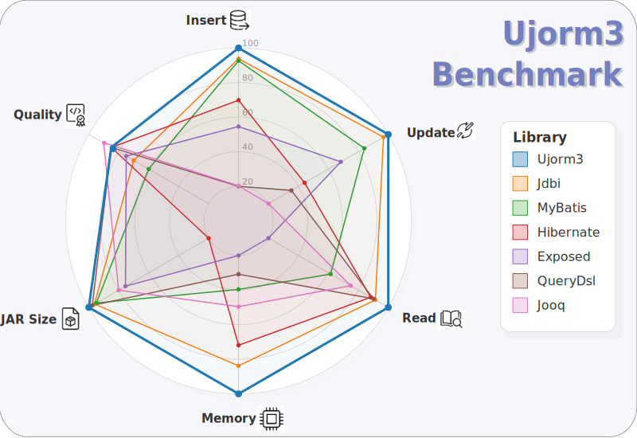

# ORM Benchmark

This project compares the performance of several Java/Kotlin ORM and database mapping frameworks.

## Environment

* **Java Version:** 25.0.2 (java-25-amazon-corretto).
* **Database:** PostgreSQL **18.3** — pinned as Docker image `postgres:18.3-alpine3.23` in `Dockerfile`.
* **Hardware/Memory:** ~15 GiB total RAM available (tested on a machine with 15 GiB RAM).
* **Operating System:** Ubuntu 24.04.4 LTS.

## Tested Frameworks

* **Hibernate Core:** `7.0.0.Final`.
* **JDBI3 Core:** `3.51.0`.
* **jOOQ:** `3.19.6`.
* **Exposed:** `0.58.0`.
* **MyBatis:** `3.5.15`.
* **QueryDSL:** `5.1.0`.
* **Ebean:** `15.5.1`.
* **Ujorm3:** `3.0.0-RC5`.

To execute the performance tests against this default PostgreSQL database, use the `run-benchmarks-pg.sh` script.

## Test Scenarios & Metrics

All tests exclude the initial warm-up phase to ensure accurate JIT compilation and memory allocation measurements.
The default number of iterations is **500,000**.
All values shown in the benchmark table are arithmetic averages computed from three independent measurement runs.
The table columns represent the following metrics:

* **Single Insert [s]:** The total time taken to insert employee records one by one in separate transactions (lower is better).
* **Batch Insert [s]:** The total time taken to insert generated employee records into the database using JDBC batching with a batch size of 50 (lower is better).
* **Specific Update [s]:** The total time taken to update specific columns (`salary` and `updated_at`) for all existing employee records in a single transaction (lower is better).
* **Random Update [s]:** The total time taken to iterate through all employees and randomly modify either their `is_active` status or `department` name to simulate an unpredictable workload, saved in batches (lower is better).
* **Read Rels [s]:** The total time taken to retrieve all employee records along with their associated `City` and superior `Employee` entities using SQL JOINs to prevent the N+1 select problem, mapping them into a flat projection (lower is better).
* **Read Entity [s]:** The total time taken to retrieve employee records and map them into a fully populated, nested entity graph (mapped manually if the framework lacks automatic nested mapping support; lower is better).
* **Mem [B/op]:** The amount of temporary Heap memory allocated in **Bytes per operation**, indicating the volume of generated garbage.
  Lower allocation means less pressure on the Garbage Collector, resulting in lower CPU usage, fewer latency spikes, and better overall execution speed.
* **JAR Size [MB]:** The total file size of the compiled `jar-with-dependencies` archive, excluding database JDBC drivers to keep the framework packaging comparison fair (lower is better).
* **Quality [0-100]:** An evaluation of code cleanliness, type safety, boilerplate reduction, and estimated maintenance costs, following the weighting recommended by Gemini Pro (higher is better).

For chart comparison scores, raw measured values are used directly without mean pre-normalization.
The `Insert` score is computed as the average of `Single Insert` and `Batch Insert`.
The `Select` score is computed as the average of `Read With Relations` and `Read Entity` metrics.
The `Update` score is computed as the average of `Specific Update` and `Random Update`.
The `Memory` score is computed as the average of all memory columns.
The `JAR Size` metric remains standalone.
Each metric is then min-max scaled to a range of `20..100` so that higher is always better.
The formula used for lower-is-better metrics is `20 + 80 * (max - value) / (max - min)`, substituting `60` if all values are identical.

### How Quality was scored

The `Quality` score is a weighted estimate rather than a direct runtime metric.
It combines the following aspects:

* **Maintenance/refactoring cost (30%):** This represents the expected effort to evolve schemas, queries, and domain mappings safely over time.
* **Code cleanliness & API ergonomics (30%):** This evaluates the readability of benchmark scenarios, verbosity, and clarity of intent.
* **Boilerplate reduction (20%):** This measures the amount of repetitive setup and mapping code needed per scenario.
* **Type safety (20%):** This assesses the compile-time guarantees in query construction, mapping, and update operations.

Performance and memory results from this benchmark are used as secondary calibration signals, not as the primary scoring axis for `Quality`.

## Benchmark Results (PostgreSQL)

| Library | Single Insert [s] | Batch Insert [s] | Specific Update [s] | Random Update [s] | Read Rels [s] | Read Entity  [s] | Mem Single [B/op] | Mem Batch [B/op] | Mem Update [B/op] | Mem Rand Upd [B/op] | Mem Read w/ Rel. [B/op] | Mem Read [B/op] | JAR Size [MB] | Quality [0-100] |
|:--------|---------------------:|--------------------:|---------------------:|---------------------:|-------------------:|---------------------:|---------------------:|---------------------:|---------------------:|---------------------:|---------------------:|---------------------:|---------------------:|--------------------:|
| Ujorm3 | 31.28 | 16.29 | **39.27** | 46.39 | 3.37 | 6.91 | 4_085 | 3_572 | **11_478** | **10_088** | **1_206** | 10_773 | **0.26** | **88** |
| Jdbi | 31.77 | **12.03** | 40.75 | 44.62 | 2.60 | **5.85** | 14_416 | 4_006 | 17_479 | 15_586 | 2_297 | **8_643** | 1.34 | 76 |
| MyBatis | 43.24 | 29.86 | 39.89 | **43.52** | 3.32 | 8.43 | 4_606 | 4_670 | 17_836 | 15_653 | 6_019 | 15_025 | 1.73 | 66 |
| Hibernate | 44.78 | 44.47 | 56.60 | 59.58 | 2.23 | 8.20 | 8_946 | 8_072 | 36_239 | 36_170 | 1_379 | 9_982 | 23.13 | 70 |
| Exposed | 58.56 | 19.12 | 137.77 | 137.33 | 7.76 | 9.54 | 23_473 | 15_398 | 33_289 | 31_204 | 10_307 | 19_042 | 7.27 | 64 |
| QueryDsl | 28.25 | 17.04 | 47.17 | 47.82 | 2.28 | 8.27 | 38_811 | 36_326 | 85_616 | 83_471 | 1_380 | 11_218 | 0.91 | 68 |
| Jooq | 29.68 | 17.79 | 46.61 | 48.77 | 3.63 | 9.54 | 19_604 | 20_023 | 44_200 | 42_886 | 2_083 | 13_347 | 5.95 | 82 |
| EBean | **24.69** | 12.37 | 86.19 | 87.36 | **2.21** | 6.50 | **3_896** | **2_867** | 15_626 | 13_349 | 2_296 | 11_781 | 6.91 | 74 |

The `Quality` metric evaluates aspects such as the type-safety of the API, the amount of required boilerplate for CRUD operations and relation mapping, and the predictability of the persistence context.
The score variations among libraries primarily reflect differences in their architectural approaches to mapping complex entity structures and the corresponding configuration requirements.

**Notes:**

- Performance tests executed against the H2 database lead to a slightly different ranking of the tested libraries, with `Ujorm3` consistently outperforming the alternatives across practically all performance metrics.
  To run these specific tests yourself, use the `run-benchmarks-h2.sh` script.
- The Spring Data JDBC library was excluded from this specific benchmark.
  Its design, which centers around the Aggregate Root pattern, requires a different approach to mapping deep-nested entity graphs and complex JOIN scenarios, making a direct one-to-one comparison difficult in this particular test setup.

## Benchmark Results (H2 in-memory)

The following table displays the measurement results for the H2 database in in-memory mode.
Please note how different databases also change the ranking in certain metrics.

There is no need to repeat **the same** values for the `JAR Size` and `Quality` metrics in the table.

| Library | Single Insert [s] | Batch Insert [s] | Specific Update [s] | Random Update [s] | Read Rels [s] | Read Entity  [s] | Mem Single [B/op] | Mem Batch [B/op] | Mem Update [B/op] | Mem Rand Upd [B/op] | Mem Read w/ Rel. [B/op] | Mem Read [B/op] |
|:--------|---------------------:|--------------------:|---------------------:|---------------------:|-------------------:|---------------------:|---------------------:|---------------------:|---------------------:|---------------------:|---------------------:|---------------------:|
| Ujorm3 | **1.680** | **1.245** | **7.995** | 8.974 | **0.534** | **1.824** | **12_713** | **12_029** | **71_800** | **72_510** | **2_169** | **4_569** |
| Jdbi | 4.481 | 1.516 | 8.446 | **8.726** | 0.814 | 2.220 | 23_297 | 13_790 | 79_696 | 79_913 | 3_162 | 6_554 |
| MyBatis | 2.023 | 1.563 | 9.102 | 8.966 | 1.196 | 3.653 | 13_220 | 12_939 | 77_311 | 77_243 | 6_970 | 7_466 |
| EBean | 2.078 | 1.842 | 12.168 | 11.844 | 0.747 | 2.180 | 12_926 | 12_917 | 76_834 | 76_717 | 3_290 | 8_893 |
| Hibernate | 3.253 | 2.565 | 13.489 | 13.476 | 0.566 | 3.863 | 17_081 | 16_064 | 97_707 | 97_638 | 2_330 | 8_085 |
| Exposed | 6.189 | 3.472 | 13.628 | 12.123 | 2.956 | 7.205 | 32_716 | 23_481 | 97_953 | 93_576 | 7_644 | 16_444 |
| QueryDsl | 5.448 | 4.794 | 13.597 | 13.918 | 0.613 | 2.926 | 47_647 | 45_355 | 142_865 | 142_793 | 2_331 | 5_003 |
| Jooq | 5.329 | 5.267 | 18.189 | 17.646 | 1.003 | 4.243 | 27_286 | 28_313 | 107_253 | 107_395 | 3_034 | 10_618 |

---

Learn more about the [Ujorm3 framework](https://github.com/pponec/ujorm/tree/ujorm3?tab=readme-ov-file#-ujorm3-framework).